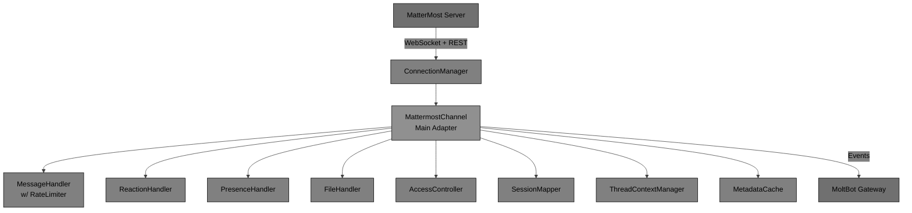
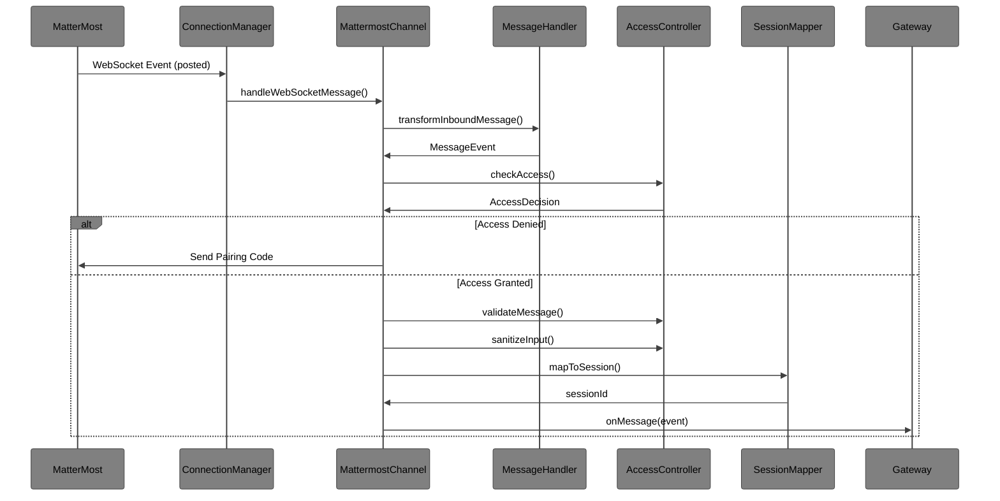
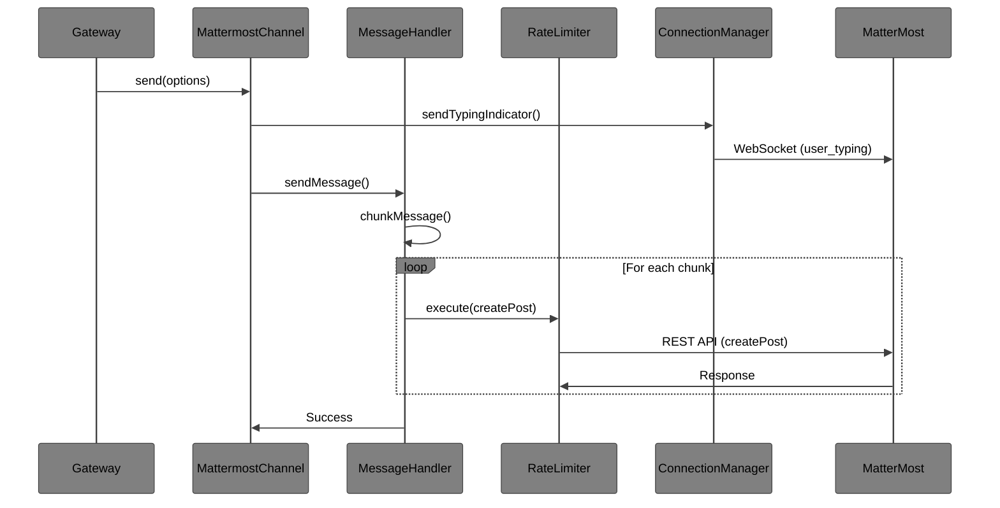
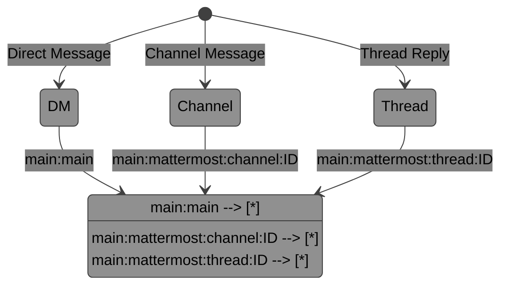
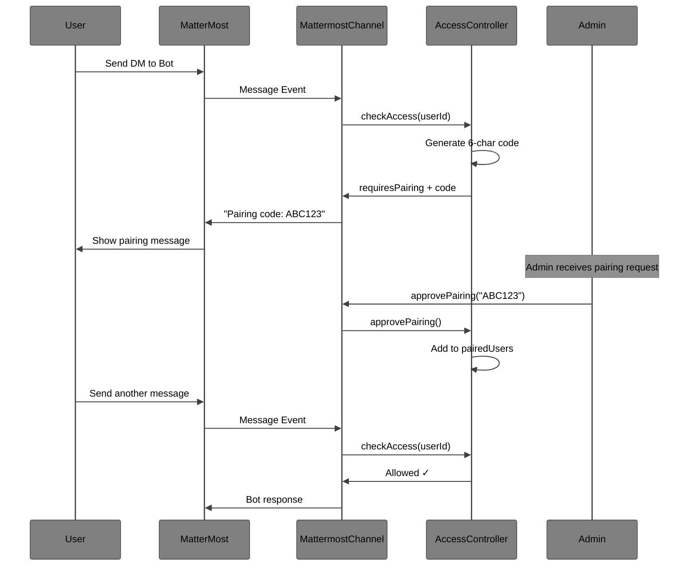
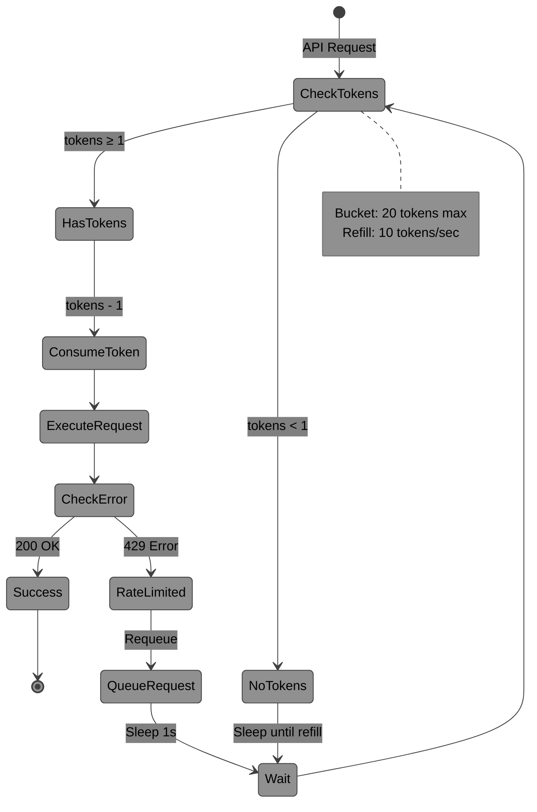

# MatterMolt

**MatterMost channel adapter for MoltBot Gateway**

MatterMolt is a native MoltBot channel adapter that connects MatterMost to the MoltBot Gateway, enabling AI assistant interactions through MatterMost chat, files, voice, and other features. It implements full feature parity with existing Clawdbot Slack and Discord channel adapters.

## Features

### Core Messaging
- 🔌 Real-time MatterMost integration via Bot API and WebSocket
- 💬 Text message send/receive in DMs and channels
- 📎 File upload/download (images, audio, video, documents)
- ✏️ Message editing and deletion (inbound & outbound)
- ⌨️ Typing indicators via WebSocket
- 🔄 Auto-reconnect with exponential backoff
- 🚦 Rate limiting with message queue (429 detection)

### Rich Interactions
- 👍 Reactions: Add/remove emoji reactions
- 🧵 Thread support with context tracking
- 🟢 Presence/status: Bot status updates and user tracking
- ⚡ Slash command detection

### Security & Access Control
- 🔒 DM pairing with 6-character codes
- ✅ Pattern-based allowlists (wildcards supported)
- 🚪 Channel access control with mention gating
- 🛡️ Input sanitization and validation

### Advanced Features
- 💾 Metadata caching (users, channels, teams)
- 📊 Comprehensive statistics and monitoring
- 🔍 Team and channel discovery APIs

## Installation

```bash
npm install moltbot-mattermost
```

## MatterMost Bot Setup

1. **Create a bot account in MatterMost:**
   - Go to System Console → Integrations → Bot Accounts
   - Click "Add Bot Account"
   - Enter a username (e.g., `moltbot`)
   - Add description and icon (optional)
   - Select "post:all" scope at minimum
   - Click "Create Bot Account"
   - Copy the generated access token

2. **Configure bot permissions:**
   - Add the bot to teams where it should be accessible
   - Add the bot to specific channels or allow DM access
   - Ensure the bot has permission to post messages and upload files

3. **Note your MatterMost server URL:**
   - This is the base URL of your MatterMost instance (e.g., `https://mattermost.example.com`)

## Configuration

Add MatterMolt configuration to your `~/.clawdbot/moltbot.json`:

```json
{
  "channels": {
    "mattermost": {
      "enabled": true,
      "url": "https://mattermost.example.com",
      "token": "your-bot-access-token",
      "dm": {
        "policy": "pairing"
      },
      "teams": {
        "your-team-id": {
          "channels": {
            "general": {
              "allow": true,
              "requireMention": true
            }
          }
        }
      }
    }
  }
}
```

### Configuration Options

- `enabled` (boolean, required): Enable/disable the adapter
- `url` (string, required): MatterMost server URL
- `token` (string, required): Bot access token
- `dm.policy` (string): DM access policy - `"open"` or `"pairing"` (default: `"pairing"`)
- `allowFrom` (array): List of allowed user IDs or email patterns
- `teams` (object): Per-team configuration
  - `channels` (object): Per-channel settings
    - `allow` (boolean): Allow bot in this channel
    - `requireMention` (boolean): Require @mention to trigger bot

## Usage

### With MoltBot Gateway

```bash
# Start MoltBot Gateway with MatterMolt
moltbot gateway
```

The MatterMolt adapter will automatically connect to your configured MatterMost server.

### Development Mode

```bash
# Clone the repository
git clone https://github.com/moltbot/mattermolt.git
cd mattermolt

# Install dependencies
npm install

# Run in development mode with hot reload
npm run dev
```

## Testing

```bash
# Run all tests
npm test

# Run tests in watch mode
npm run test:watch

# Generate coverage report
npm run test:coverage
```

## Development

```bash
# Build the project
npm run build

# Watch for changes and rebuild
npm run watch

# Lint code
npm run lint

# Format code
npm run format

# Type check
npm run typecheck
```

## Requirements

- Node.js >= 18.0.0
- MatterMost server version 7.0 or higher
- MoltBot Gateway

## Architecture

### Component Overview



### Components

- **MattermostChannel**: Main adapter class that extends MoltBot's Channel base
- **ConnectionManager**: Handles WebSocket connection, authentication, and reconnection
- **MessageHandler**: Transforms messages between MatterMost and MoltBot formats with rate limiting
- **FileHandler**: Manages file upload/download operations
- **SessionMapper**: Maps MatterMost conversations to MoltBot sessions
- **AccessController**: Enforces access control policies
- **ReactionHandler**: Manages emoji reactions on messages
- **PresenceHandler**: Tracks bot and user presence/status
- **ThreadContextManager**: Maintains thread participant and context tracking
- **MetadataCache**: Caches user, channel, and team information (1-hour TTL)
- **RateLimiter**: Token bucket rate limiter with message queue

## Message Flow

### Inbound Message Processing



### Outbound Message Processing



## Session Mapping



**Session Formats:**
- **DMs**: `agent:main:main`
- **Channels**: `agent:main:mattermost:channel:<channelId>`
- **Threads**: `agent:main:mattermost:thread:<threadId>`

## Contributing

See [CONTRIBUTING.md](./CONTRIBUTING.md) for development guidelines.

## License

MIT - See [LICENSE](./LICENSE) for details.

## Security Flow

### DM Pairing Process



## Rate Limiting

### Token Bucket Algorithm



**Configuration:**
- **Rate**: 10 requests/second
- **Burst**: 20 requests
- **429 Handling**: Automatic retry with 1s delay

## Support

- Report issues: [GitHub Issues](https://github.com/moltbot/mattermolt/issues)
- Documentation: [GitHub Wiki](https://github.com/moltbot/mattermolt/wiki)
